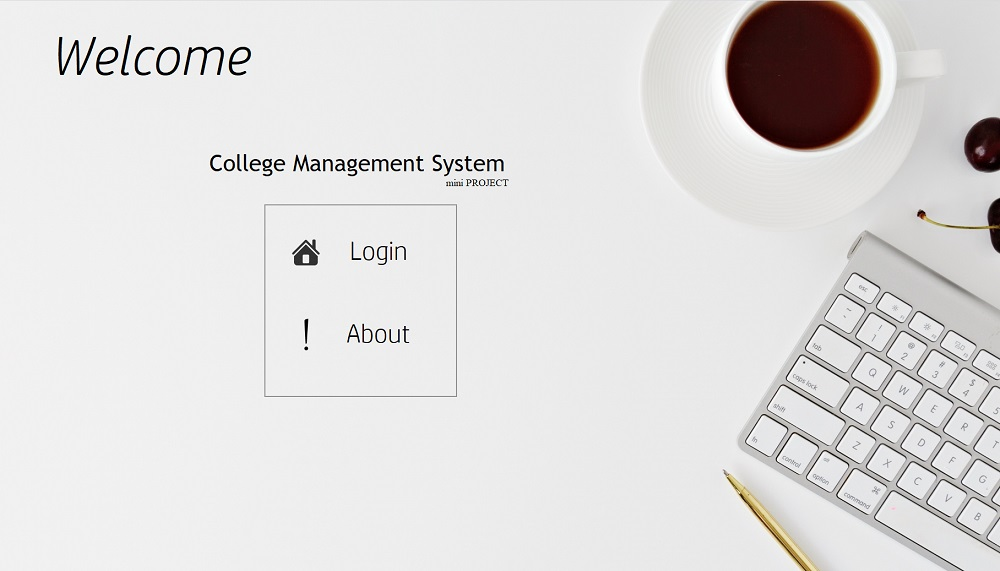

# college-management-system
---

## Introduction
This is my second year mini project in B.E. Information tech. programme.

This application is developed with `JAVA SWING for GUI` and linked with `MySQL database` at backend. Data manipulation and validation is done with `JAVA` programming language.

College Management System helps in daily chores of college such as common noticeboard, student/teacher details, Student result analysis etc.

By this application the management/availability of student result & details would be handy to the management authority, any notices can be conveyed
to the students through common noticeboard, result of students is stored in database according to the year of study.
Provisions are made to view the result of passed out batches also.

**[View project report](https://github.com/tanaydpatel/college-management-system/raw/master/Project%20Report%20-%20College%20management%20system.pdf)**

---

## Detailed description of working

***Account creation (only by students)***

1. Student need to choose a available username and set a password for thier account.
2. Fill the require details for account creation such as full name, DOB, year of study, division, Permanent registration number (PRN) etc.
3. Answer security questions which will be useful in case of reseting the password.
4. This account will be forwarded to HOD for activation.
    Till then account is inactive.
    
***Features available to students***

  After account is activated by HOD students can login with their credentials.
  They can perform following task.

  - **View** common noticeboard.
  - **View** thier personal details.
  - **View** their result of with semester wise analysis.

***Features available to Teachers***

  - **View/Edit** common noticeboard.
  - **View** thier personal details.
  - **View** result of all the students with `semester wise analysis and filter`.
  - **View** details of all the students with appropriate filters.

***Features available to HOD***

  In addition to features available to teachers HOD have the following capabilities,
  - **View** activate a student account OR reject the account.
  - **View** details of all the teachers.

**NoticeBoard**

Entry on noticeboard is automatically deleted after 30 days. This is taken care of by triggers in the MySQL database which runs when a noticeboard is accessed.

---

## Technical description

- Exception handling of data is done at database layer which is already validated ay front-end by `JAVA`.
- Password validation is done at Database.
- Password is saved in binary file since normal entry in dtabase is not case sensitive.

**Table format in database** 

*Detailed description of database table structure can be found in **[project report here](https://github.com/tanaydpatel/college-management-system/raw/master/Project%20Report%20-%20College%20management%20system.pdf)**.*

Example *Student login credentials table*:

| Field | Type | Null | Key | Default | Extra |
|---|---|---|---|---|---|
| UserID | varchar(15) | NO | PRI | NULL | |
| Password | blob | NO | | NULL | |
| Status | tinyint(4) | NO | | 0 | |
| Secure1 | varchar(15) | YES | | NULL | |
| Secure2 | varchar(15) | YES | | NULL | |
| Secure3 | varchar(15) | YES | | NULL | |

*Note:*
  - UserID is username of student. (case insensitive)
  - Password is password of account. (case sensitive)
  - Status is activation status os account (active/inactive decided by HOD).
  - Secure 1/2/3 are security questions . (case insensitive)
 
 ---
 
**[Snapshot from the project](FinalProject-Screenshots&Video/) can be found here**

*[Video of working project](FinalProject-Screenshots&Video/college-management-system.mp4).*

**[View project report](https://github.com/tanaydpatel/college-management-system/raw/master/Project%20Report%20-%20College%20management%20system.pdf)**

---
  

